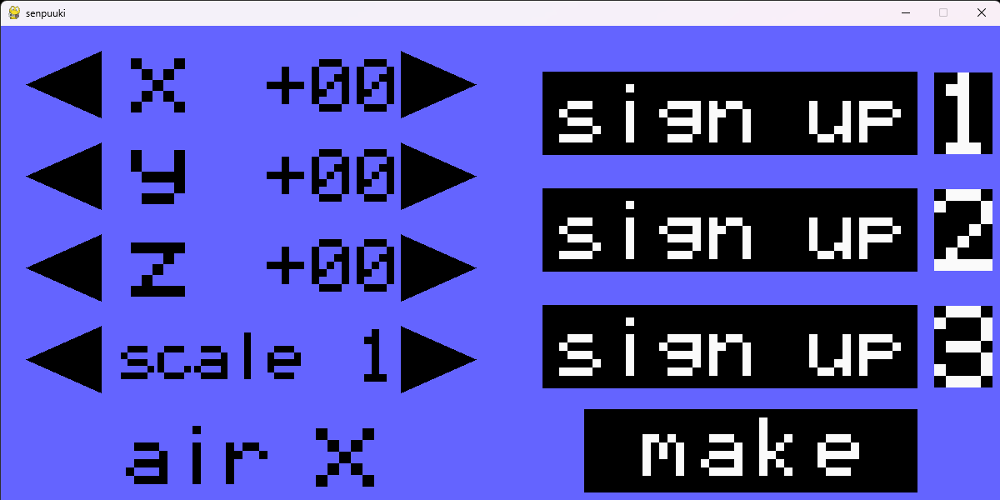
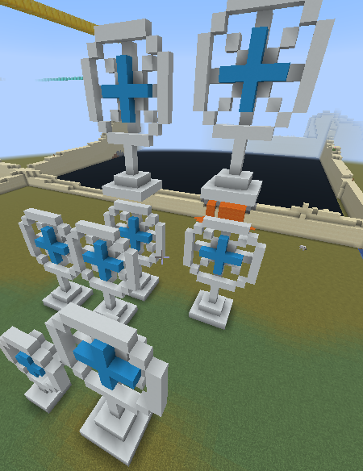
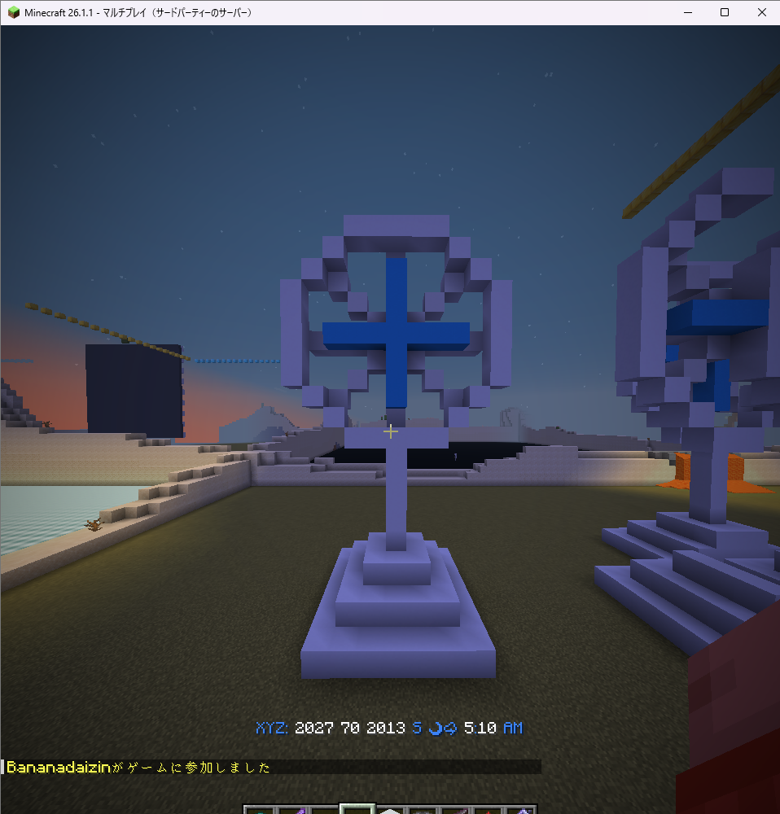
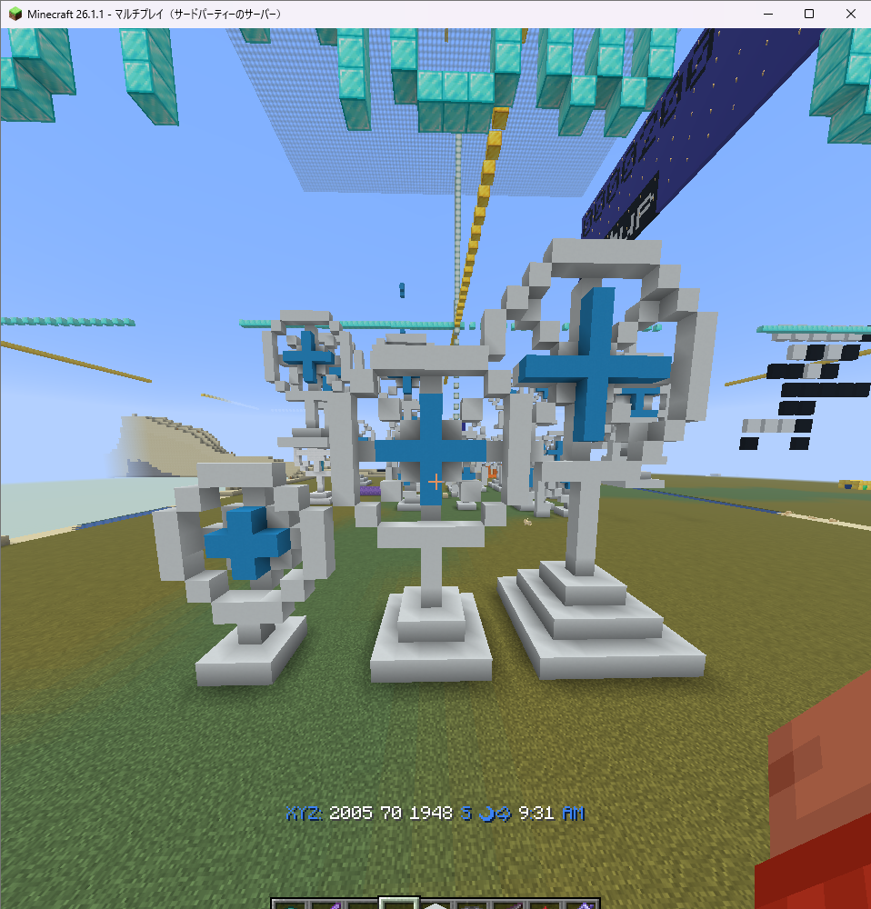

# minecraft_remote_senpuuki  
## 扇風機を量産する

# 説明
### pygameを使って、マイクラ世界に扇風機をつくることにプラスして大きさや作る位置を変えれるようにする

## pygameの画面

# 数値について
## 座標はparam_mc_remote.pyの中のPLAYER_ORIGINとY_SEA(y=62)を基準に作られ、そこからプラス・マイナス50までの範囲、scaleは1~3の範囲で設定できる

# プリセットについて
## 1~3個まで登録することができる。使う際はまず数値をセットする。その後、sign upを押すと登録されるので、横のボタンを押すとできます。

# airについて
## 扇風機の周りのブロックを消すかどうか決めるボタンです。
<video controls src="videos/air.mp4" title="Title"></video>

# 実際に作ってみる
## scale1

## scale2

## scale3

## 並べてみる
